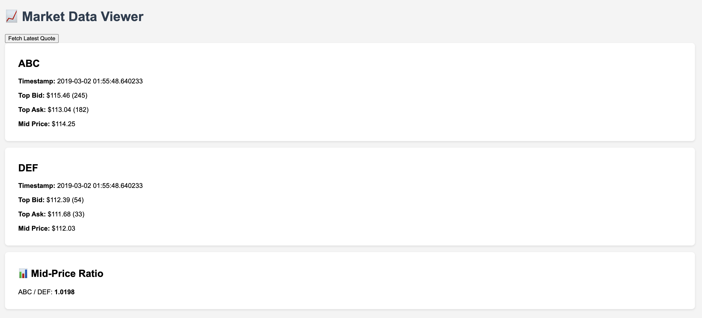
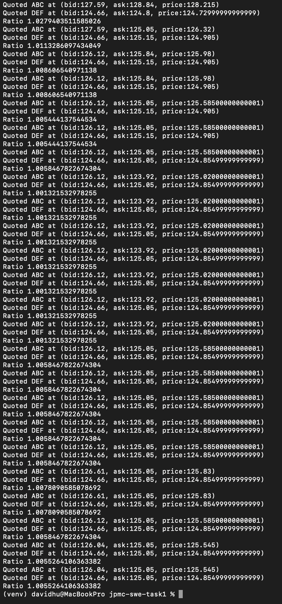

# JPMC Software Engineering Virtual Experience – Task 1

This project was part of JPMorgan Chase's Software Engineering Job Simulation on Forage. The task simulates a basic trading system by generating mock market data and serving bid/ask quotes for two fictional stocks.

The original goal of this task was to:

- Set up a development environment.
- Interface with a live data feed simulator.
- Understand how traders can use data to identify under/over-valued stocks.

I completed this project early in my learning journey and have since revisited the code to clean it up, modernize the structure, and improve usability.

---

## 💡 Project Overview

This task involves:

- Running a Python-based HTTP server that simulates order book activity for two stocks (`ABC` and `DEF`).
- Fetching the top bid/ask prices and calculating mid-price ratios in a client script.
- (Optional extension) Displaying the data visually through a lightweight HTML viewer.

The original implementation prints results in the terminal via a Python script. I added a simple web-based interface (HTML/CSS/JS) to make the output easier to view and more accessible for non-technical reviewers.

---

## 🧠 My Contributions

In addition to completing the original task, I:

- Cleaned and refactored starter code for clarity and maintainability.
- Added a `.gitignore` and ensured the repo excludes unnecessary cache/venv files.
- Created a virtual environment and requirements file for reproducibility.
- Built a basic UI using vanilla HTML, CSS, and JS that fetches and displays real-time market data from the server.
- Updated the server to serve the frontend and support both the original `/query` endpoint and the new `/` UI.

---

## 🛠️ How to Run

1. **Clone the repository**

   ```bash
   git clone https://github.com/your-username/jpmc-swe-task.git
   cd jpmc-swe-task
   ```

2. **Set up a virtual environment**

   ```bash
   python3 -m venv venv
   source venv/bin/activate  # On macOS/Linux
   # OR
   venv\Scripts\activate     # On Windows
   ```

3. **Install dependencies**

   ```bash
   pip install -r requirements.txt
   ```

4. **Run the server**

   ```bash
   python3 server3.py
   ```

5. **Open the UI in your browser**

   Navigate to:
   ```
   http://localhost:8080/
   ```

   Click the **“Fetch next quote”** button to retrieve and display the latest prices for both stocks.

6. **(Optional) Run the original Python client**

   ```bash
   python3 client3.py
   ```

7. **(Optional) Run unit tests**

   ```bash
   python3 client_test.py
   ```

---

## 🖼️ Visual Screenshots

- 📷 **Web UI example:**  
  

- 🖥️ **Terminal output from `client3.py`:**  
  

---

## 📌 Notes

- This task was originally part of the [JPMC Software Engineering Virtual Experience](https://www.theforage.com/simulations/jpmorgan/software-engineering-btjx), which has since been archived and replaced by a newer version.
- The starter repo and original logic were provided by JPMC. Enhancements, cleanup, and the HTML-based UI are my own additions.

---

## 💭 Motivation

As someone interested in the intersection of finance and technology, I completed this project to explore how software engineering supports financial systems. While simple, it sparked my interest in fintech and laid foundational skills I’ve continued to build on. The added HTML view was built to help showcase the result more clearly for recruiters and technical reviewers.
