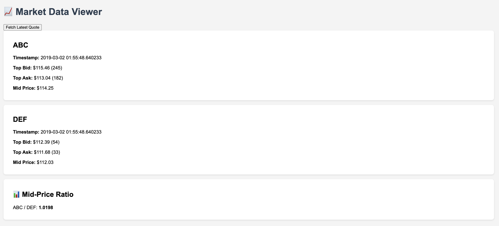
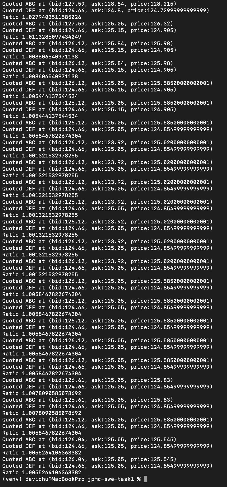

# Task 1: Stock price feed

[← Software Engineering (Perspective)](https://github.com/dhu2022-dev/job-simulations/blob/main/jpmc/swe-perspective/README.md)

[Task 2 →](https://github.com/dhu2022-dev/jpmc-swe-task2)

Task 1 from the JPMC Software Engineering (Perspective) job sim. Python server that serves mock bid/ask quotes for two stocks; fixed client computes mid-prices and their ratio. I also added a small web UI served from the same server.

## How to run

1. Clone and enter the repo:

   ```bash
   git clone https://github.com/dhu2022-dev/jpmc-swe-task1.git
   cd jpmc-swe-task1
   ```

2. Set up a virtual environment:

   ```bash
   python3 -m venv venv
   source venv/bin/activate  # macOS/Linux
   # OR: venv\Scripts\activate  # Windows
   ```

3. Install dependencies:

   ```bash
   pip install -r requirements.txt
   ```

4. Start the server:

   ```bash
   python3 server3.py
   ```

5. Open `http://localhost:8080/` and click **Fetch next quote**, or run the original client:

   ```bash
   python3 client3.py
   ```

6. (Optional) Run unit tests:

   ```bash
   python3 client_test.py
   ```

## Screenshots

Web UI:



Terminal output from `client3.py`:


